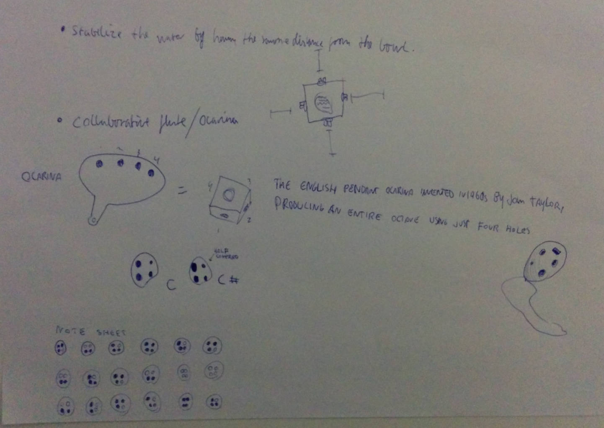
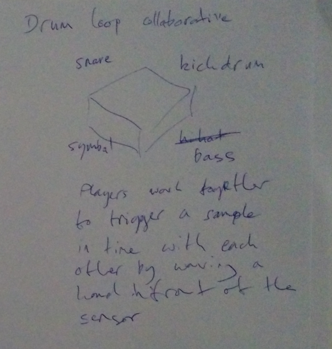
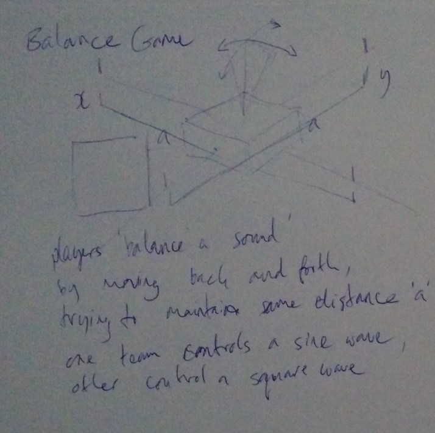
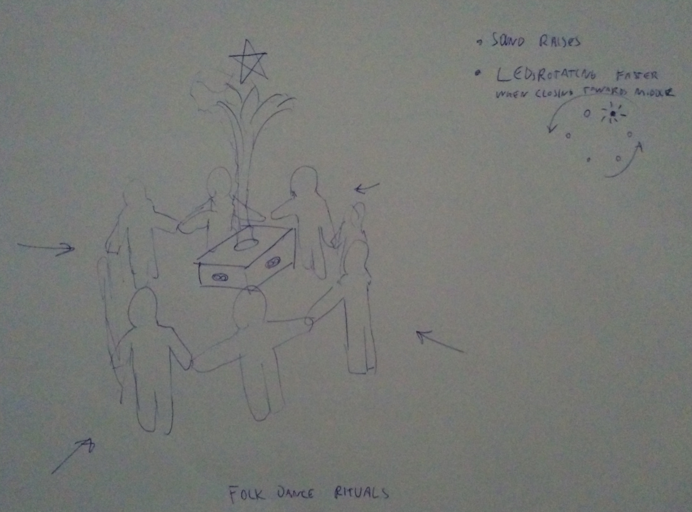
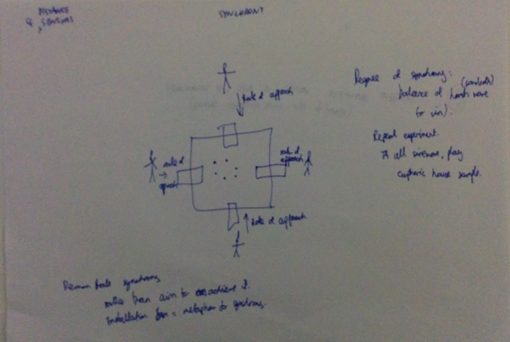
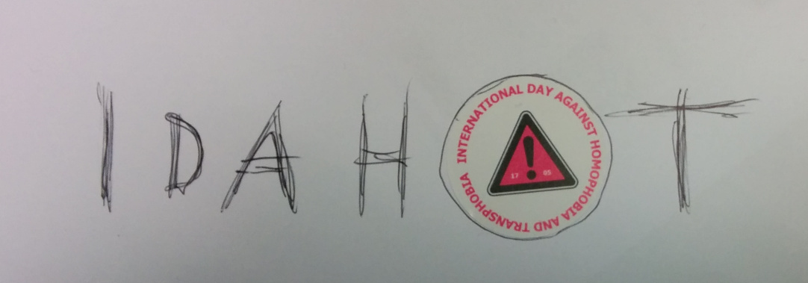

From workshop at [Do It Anyway festival]
(http://www.opensourcingfestivals.eu/events/do-it-anyway-festival-sheffield-uk),
held May 15-17 2015 in Sheffield, UK.

Links
==========
Material used/mentioned during workshop.

SuperCollider, programming language and IDE for sound.
[Homepage](http://supercollider.github.io/), [Example codes](http://sccode.org)

[Open Sound Control](http://en.wikipedia.org/wiki/Open_Sound_Control),
protocol for communicating data between applications, sensors etc in real-time.
Easy to use in SuperCollider, Pure Data etc.
[Control](http://charlie-roberts.com/Control/), OSC app for Android,
support for many user interfaces. Multitouch, accelorometer, sequencer.

[Flowhub](http://flowhub.io), visual programming IDE. With
[MicroFlo](http://microflo) can program microcontrollers,
with [sndflo](http://github.com/jonnor/sndflo) can program SuperCollider.
[NoFlo](http://noflojs.org) can be used for general-purpose JavaScript/CoffeScript,
and was used glue MicroFlo/Arduino <-> sndflo/SuperCollider together.

Concepts
=========
These are the concepts developed by the six workshop participants,
around the idea of [synchrony](http://github.com/jonnor/synchrony):
How peoples behavior tend to syncronize and its effect on perception & communication.

Collaborative Ocarina
------------------

Each distance sensor is mapped to the coverage of the 4 holes
on a English pendant [Ocarina](http://wikipedia.org/Ocarina).
To make a particular note, have to have a certain distance on
all 4 holes.

Kadinski figures
----------------

Position of participants (distance to sensor) form geometric figures:
3 matching distances becomes a triangle, 4 ueven distances become rectangle,
4 perfect matches a circle, etc
Each figure can have a distinct visualization and/or sonification.

Collaborative drumloop
----------------------

Each distance sensor is mapped to a drum sample.
People work together to trigger samples by changes in distance.

Balance game
-------------

4 participants balance a sound put on a virtual pendulum with 2-axis of freedom,
by changing their distance from the sensors.

Haravot folkdance
----------------

People hold hands to form a circle around the box with the four sensors.
When they move together towards center, audiovisuals intensify and
tops as the closest position.

[Sketch for SuperCollider code](../supercollider/example-haravot.scd)

Rate of Approach
----------------

Peoples rate of approach has to match to trigger audiovisuals.

Idahot
------

International Day Against Homophobia and Transphobia

